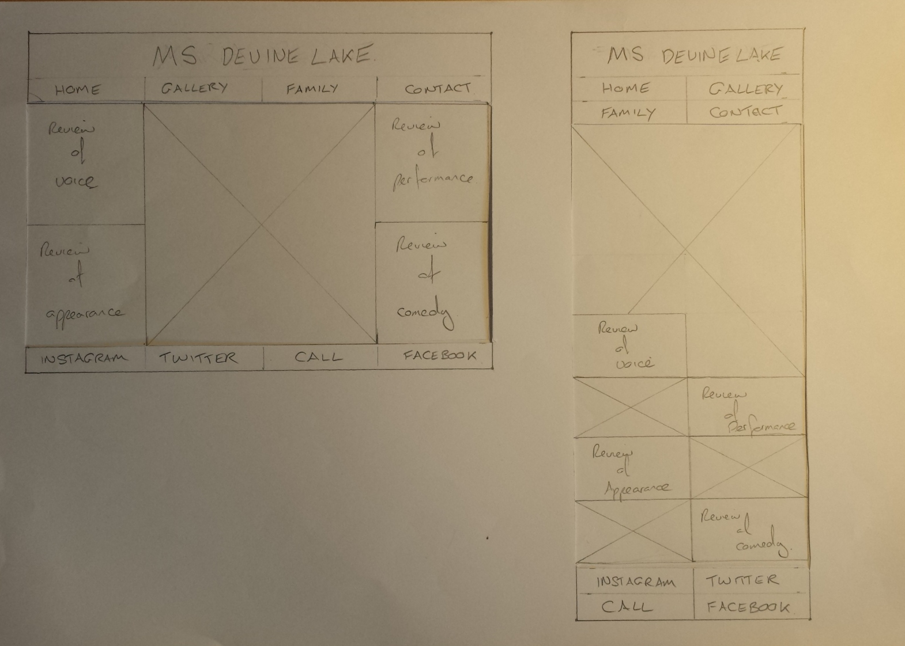
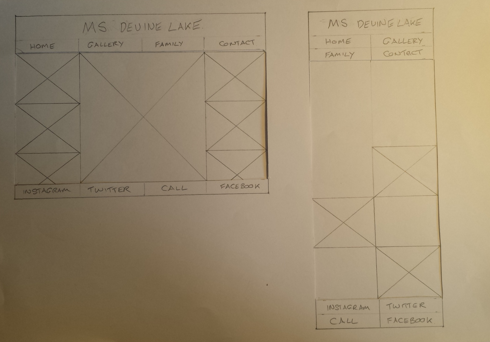
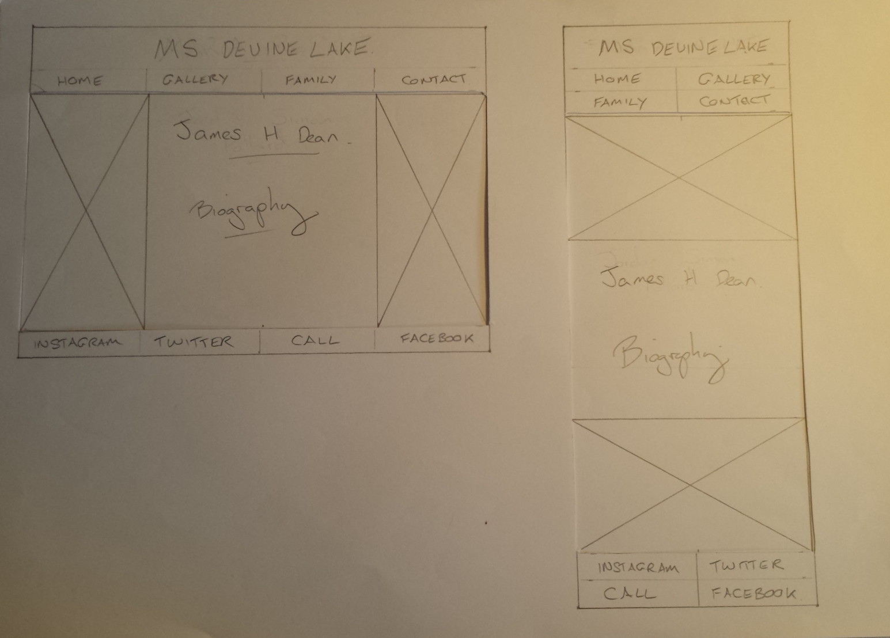
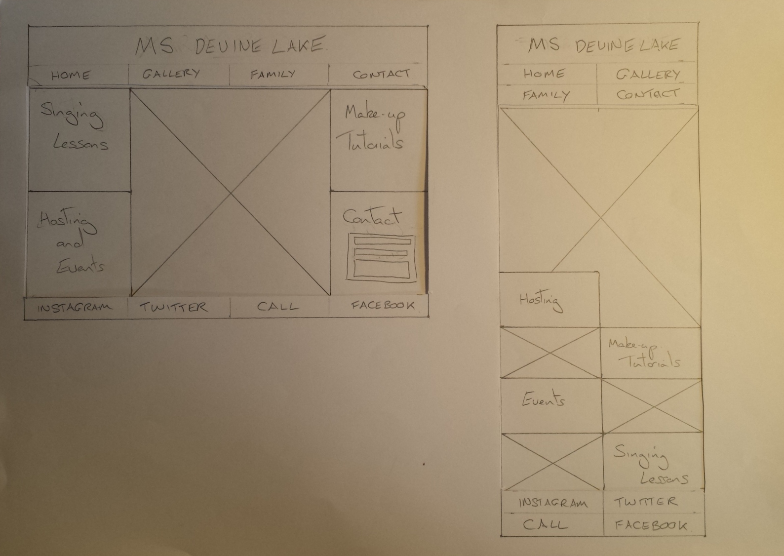

# **Ms Devine Lake** #
***
>## **Project Overview** ##

Ms Devine Lake is an up and coming drag act with so much more to offer.\
This site hopes to highlight these attributes and sell her as a performer, host, comedian, \
and also sell the man behind the lashes, as James himself is a trained actor and singer \
with many years experience to share....for the right price.\
As well as showcasing the talent, this site is very much about making contact, with the end result \
being booked for paid work.

>## **UX** ##

***Desire/Home***\
As a user, I want to see the performer, read about her reputation, get a gist of what she can offer me \
and be able to move to other pages to learn more.\
I also want to be able to make contact and have a choice of what platform I use to do so.\
***Intrigue/Gallery***\
As a user, I want to see more of the performer in various situations, settings and appearances \
and be able to move to other pages to learn more.\
I also want to be able to make contact and have a choice of what platform I use to do so.\
***Obsession/Biography***\
As a user, I want to learn more about the performer himself, to see him his work history \
and be able to move to other pages to learn more.\
I also want to be able to make contact and have a choice of what platform I use to do so.\
***Thirst/Contact***
As a user, I want to learn more about what the performer can offer and be able to make direct contact\
and be able to move to other pages to learn more.\
I also want to be able to make contact and have a choice of what platform I use to do so.
>## **Features** ##

On each of the four pages there are navigation buttons to there relavant page.\
They are listed under Desire, Intrigue, Obsession and Thirst. To make the site as \
accessible as possible, there is also a dropdown menu, the boxed in star, with more \
conventional menu headings, Home, Gallery, Biography and Contact, each linked to the relavant\
page. /
Also on each page there is navigation to social media links of Instagram, Twitter, Facebook and \
Linkedin.\
***Desire/Home***\
Contains an image, or images depending on size of device, of Ms Devine Lake, \
along with reviews of her performance.\
***Intrigue/Gallery***\
Contains images of a number of Ms Devine Lake's performances.\
***Obsession/Biography***\
Contains images of James preparing to become Ms Devine Lake, and his biography of previous work.\
***Thirst/Contact***\
Contains an image of Ms Devine Lake/James and information on what a user can get from James, \
So get help with vocals, performance and also make a booking for events.\
There is also a contact form to make enquiries, to add to the list of ways to get in touch.

### **Furture Features** ###

***Desire/Home***\
Existing reviews can be removed and new reviews and be put in to keep the site current. \
Images can easily be changed and the extra imaged removed if neccessary depending on spacing for various devices. \
***Intrigue/Gallery***\
Images can easily be removed, replaced or just rearranged to keep the site current and fresh.\
***Obsession/Biography***\
Images can easily be changed abd the biography added to as and when the work increases. \
***Thirst/Contact***
The image can be changed and the services offered can be changed, deleted or added to.

The site can be added to easily with, \
-A page of videos of performances. \
-A page on vocal coaching; an introduction, techniques, examples, \
-A page on make up tutorials; example videos, before and after images, a list of options to create inspiration. \
-A page on events; videos, images, credits, examples of scenarios for inspiration.  

>## **Technologies Used** ##

To create this site I have used,\
GitPod <https://www.gitpod.io/>\
GitHub <https://github.com/>\
Bootstrap <https://getbootstrap.com/>\
Fontawesome <https://fontawesome.com/>\
Google fonts <https://fonts.google.com/>\
Pexels <https://www.pexels.com/>\
W3C <https://jigsaw.w3.org/css-validator/validator>\
W3C <https://validator.w3.org/#validate_by_input>

>## **Testing** ##

>## **Deployment** ##

>## **Credits** ###

### **-Content** ###

All text is my own words except the biography which is loosely based on two friends \
biographys from theatre programmes found on the show websites, (Phantom and Les Mis), \
which I have then altered to create a new piece.

### **-Media** ###

All photographs are taken from the Pexels website, and are by a photographer called cottonbro.

### **-Acknowledgements** ###

The inspiration for this project came from a friend who is a performer and drag queen, but \
is unfortunately unable to work due to the current situation. He is hoping to take advantage of this project \
when things turn around and he is able to offer his creative services.
Credit also needs to go to the tutors at The Code Institute, Igor, Kevin and Sheryl, my Mentor Aaron Sinnott \
my parents for the constant flow of tea and my little cat Jessica for keeping me calm.
